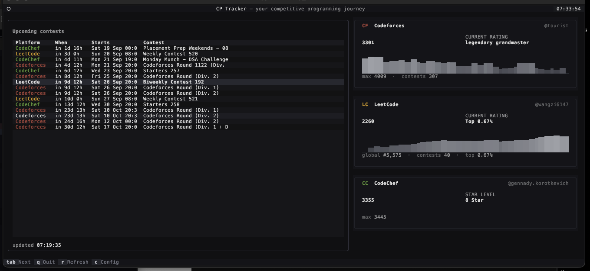

<div align="center">

# CP Tracker

[](https://www.python.org/)
[](LICENSE)
[](https://github.com/Snehal-Pradhan/cp-tracker/actions/workflows/ci.yml)

A terminal UI dashboard that tracks your competitive programming journey across
**Codeforces**, **LeetCode** and **CodeChef**.

<p align="center">
  
</p>

</div>

## Features

- **Overview dashboard** — your current rating, rank and a rating-trend sparkline
  for all three platforms on one screen, plus a combined upcoming-contests list.
- **Drill down per platform** — open any card (`Enter` or click) for a detail view:
  - **Codeforces**: rating trend, per-contest rating history / Δ, max rating, rank,
    country & organisation, upcoming CF contests.
  - **LeetCode**: contest rating, global rank, top %, solved breakdown by
    difficulty, contest history, upcoming contests.
  - **CodeChef**: rating, star level, highest rating, global / country rank.
- **Setup modal** (`c`) — enter a handle for each platform; values are stored
  locally in `~/.cp_tracker/config.json`.
- **Offline cache** — data is cached to `~/.cp_tracker/cache.json` and shown
  instantly on startup, then refreshed in the background. Refresh at any time
  with `r`.

## Install

Requires Python 3.9+ (works on macOS, Linux and Windows terminals).

### From source

```bash
git clone https://github.com/Snehal-Pradhan/cp-tracker.git
cd cp-tracker
python3 -m pip install -e .
```

### From the repo (no install)

```bash
git clone https://github.com/Snehal-Pradhan/cp-tracker.git
cd cp-tracker
python3 -m pip install -r requirements.txt
```

## Run

```bash
cp-tracker            # when installed as a package
# or
python3 -m cp_tracker # when running from the repo
```

## Configure your handles

Press `c` inside the app, or edit `~/.cp_tracker/config.json` directly:

```json
{
  "codeforces": "tourist",
  "leetcode": "wangzi6147",
  "codechef": "gennady.korotkevich"
}
```

## Keyboard

| Key         | Action                                          |
| ----------- | ----------------------------------------------- |
| `tab`       | move focus to the next widget                   |
| `enter`     | open detail for the focused card                |
| `c`         | configure handles                               |
| `r`         | refresh all data from the APIs                  |
| `q` / `esc` | quit (or go back on detail screens)             |

Mouse works too: click a platform card to open its detail view.

## Development

Run the headless smoke test (drives the whole UI: dashboard → detail →
back → config modal → quit):

```bash
python3 smoke_test.py
```

It uses mocked network data, so no internet connection is needed.

## Notes on the data sources

- **Codeforces**: official API (`api.codeforces.com`).
- **LeetCode**: public GraphQL endpoint (`leetcode.com/graphql`).
- **CodeChef**: profile-page scraping plus the site's contest-list endpoint —
  there is no official public API. Global/country rank shows `Inactive` when the
  handle is not on the current leaderboard.
- If a platform is temporarily down, the last cached data is used instead.

## Contributing

Bug reports, feature requests and pull requests are welcome. Please open an
[issue](https://github.com/Snehal-Pradhan/cp-tracker/issues) or a PR; keep
changes focused and make sure `python3 smoke_test.py` passes.

## License

[MIT](LICENSE)